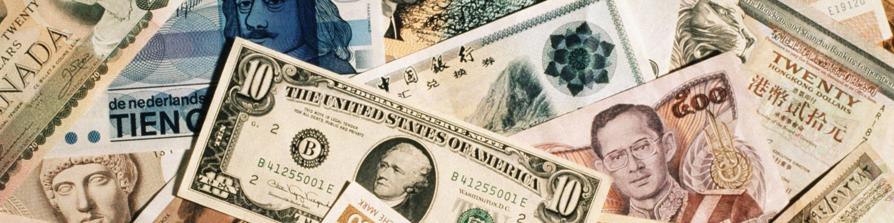

# Bank Marketing

## Content

### Dataset
The data is related with direct marketing campaigns of a Portuguese banking institution. The marketing campaigns were based on phone calls. Often, more than one contact to the same client was required, in order to access if the product (bank term deposit) would be or not subscribed.

The classification goal is to predict if the client will subscribe a term deposit.

### Libraries
- [pandas](https://pandas.pydata.org) (data manipulation and analysis)
- [NumPy](https://numpy.org) (numerical computing)
- [Matplotlib](https://matplotlib.org) & [seaborn](https://seaborn.pydata.org) (data visualization)
- [scikit-learn](https://scikit-learn.org) (machine learning)
- [imbalanced-learn](https://imbalanced-learn.org) (classification with imbalanced classes)

### Acknowledgement
This dataset was originally donated to the UCI Machine Learning Repository. You can learn more about past research using the data [here](https://archive.ics.uci.edu/ml/datasets/bank+marketing).

### Author
[LinkedIn](https://www.linkedin.com/in/brckalo)
[GitHub](https://github.com/brckalo)
[Instagram](https://www.instagram.com/brckalo_)